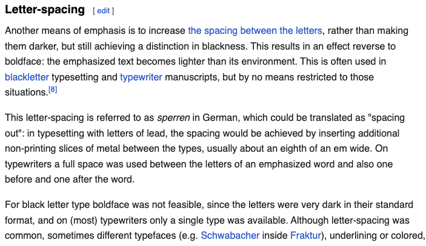
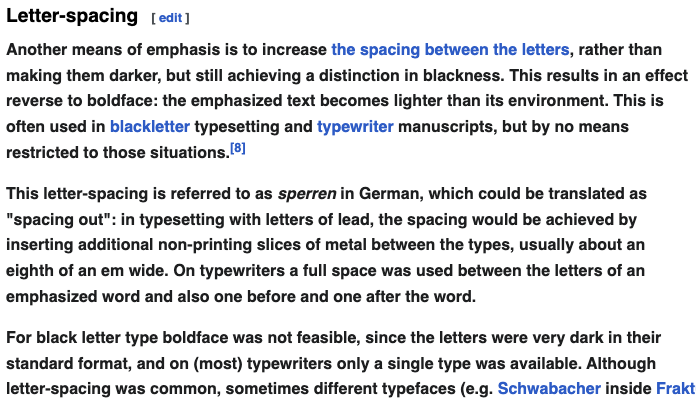

# Boldit
Simple chrome extension to bold a webpage.
# Install
1. Clone this repository
2. **Settings** $\rightarrow$ **Extensions** $\rightarrow$ **Manage Extensions**
3. Enable **Developer mode**
4. **Load unpacked** $\rightarrow$ choose the repository
## Usage
* Press `b` to toggle bold text.
## Examples

  
  

